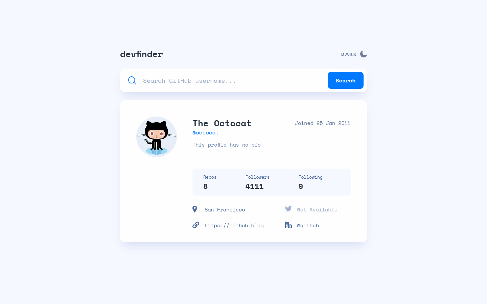
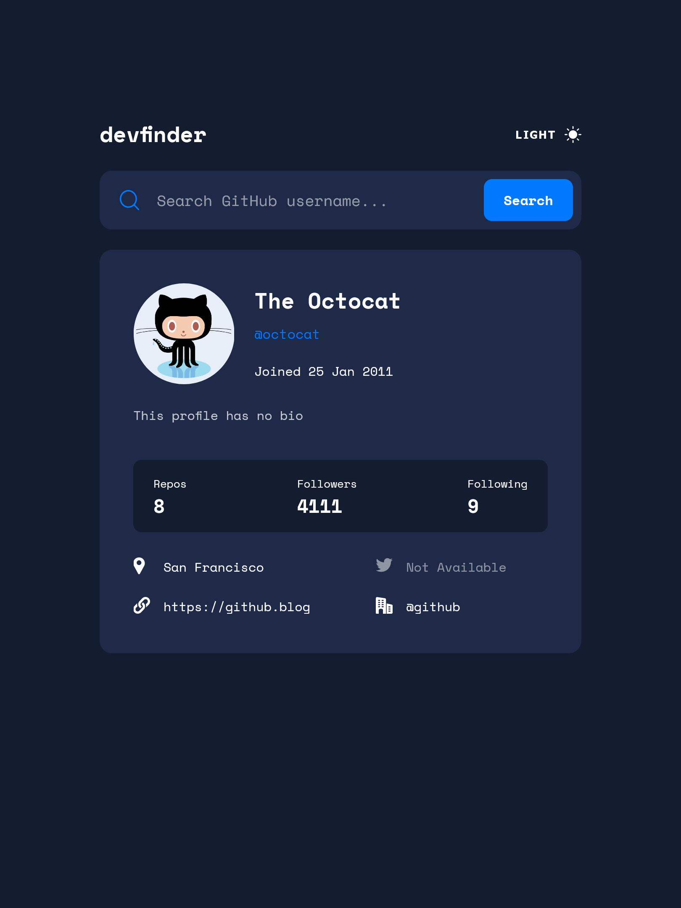
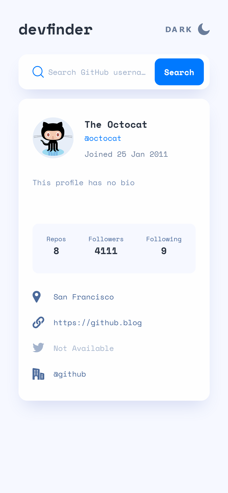

# GitHub User Search App

This is my solution to the [GitHub User Search App](https://www.frontendmentor.io/challenges/github-user-search-app-Q09YOgaH6) challenge on Frontend Mentor.

## Table of Contents

- [Overview](#overview)
  - [The challenge](#the-challenge)
  - [Screenshots](#screenshot)
  - [Links](#links)
- [My process](#my-process)
  - [Built with](#built-with)
  - [What I learned](#what-i-learned)
- [Author](#author)

## Overview

### The Challenge

Users should be able to:

- View the optimal layout for the app depending on their device's screen size.
- See hover states for all interactive elements on the page.
- Search for GitHub users by their username.
- See relevant user information based on their search.
- Switch between light and dark themes.
- **Bonus**: Have the correct color scheme chosen for them based on their computer preferences (`prefers-color-scheme` in CSS).

### Screenshots

#### Desktop (Light Theme)

#### Tablet (Dark Theme)

#### Mobile (Light Theme)

### Links

- [Solution](https://github.com/vbobey/user-search-app)
- [Live Site](https://vbobey.github.io/user-search-app/)

## My process

### Built with

- Semantic HTML5 markup
- CSS custom properties
- Flexbox & CSS Grid
- Desktop-first workflow
- [Vue](https://vuejs.org/) (JS framework)

### What I learned

I used this challenge as an opportunity to practice development with Vue. I also learned how to create toggleable light/dark themes and about the `prefers-color-scheme` media feature in CSS.

## Author

Victoria Bobey

- Github - [@vbobey](https://github.com/vbobey)
- Frontend Mentor - [@vbobey](https://www.frontendmentor.io/profile/vbobey)
